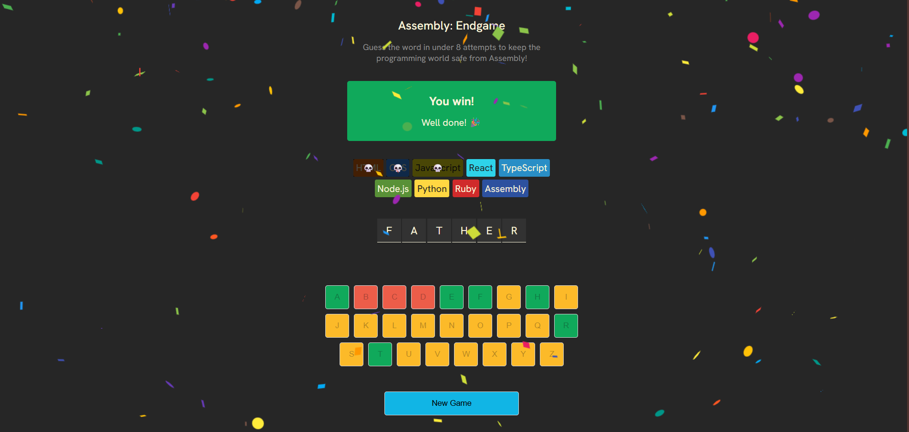

# Assembly Endgame

Assembly Endgame is a word-guessing game built with React.  
The player must guess the correct word before running out of attempts.

## Preview

## Features
- On-screen keyboard for guessing letters
- Win/Lose state with visual feedback
- New game / restart flow
- Responsive layout

## Technologies
- React
- JavaScript
- Vite
- CSS

## Live Demo
https://assembly-endgame-pearl.vercel.app/

## How to run locally
npm install  
npm run dev
